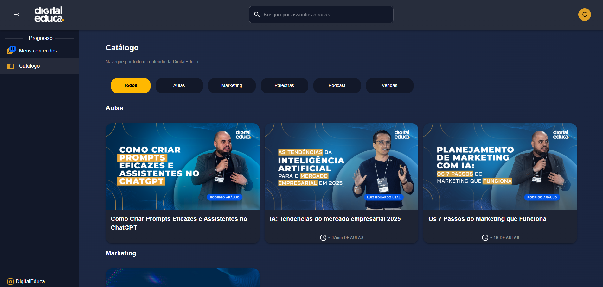
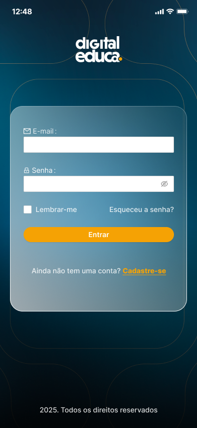

# Digital Educa

## Descrição
O **Digital Educa** é uma plataforma completa de educação online, integrando backend, frontend e aplicativo mobile.  
Permite streaming seguro de vídeos via Vimeo, controle de assinaturas e gestão de alunos e conteúdos de forma escalável e confiável.

---

## Tecnologias Utilizadas
- **Backend:** NestJS, Node.js, JWT, Stripe (pagamentos)  
- **Frontend:** React, Redux, Material UI  
- **Mobile:** Flutter (Android & iOS)  
- **Banco de Dados:** MySQL, Prisma  
- **DevOps:** Docker, AWS, CI/CD  

---

## Funcionalidades Principais
- Cadastro e autenticação de usuários com diferentes níveis de acesso  
- Integração com Stripe para pagamentos recorrentes e controle de assinaturas  
- Streaming seguro de vídeos via Vimeo  
- Painel administrativo para gestão de alunos e conteúdos  
- Aplicativo mobile com acesso completo ao conteúdo da plataforma  

---

## Prints / Demonstração
Exemplos visuais do projeto (substitua pelos seus prints):  

  
  
  

---

## Arquitetura (Resumo)
Fluxo simplificado do projeto:

```mermaid
graph TD
    A[App Mobile (Flutter) / Frontend (React)] --> B[API NestJS]
    B --> C[Banco de Dados MySQL]
    B --> D[Vimeo (Streaming de vídeos)]
    B --> E[Stripe (Pagamentos e assinaturas)]
```
## Explicação do fluxo:

O frontend e o app mobile fazem requisições à API NestJS, que gerencia autenticação, lógica de negócios e integração com banco de dados.

A API se comunica com serviços externos como Vimeo (streaming seguro de vídeo) e Stripe (pagamentos e assinaturas).

Todo o sistema é escalável, seguro e permite acesso centralizado para alunos e administradores.

## Observações

O código do projeto está em repositório privado e pode ser disponibilizado mediante solicitação.

Este README tem o objetivo de apresentar funcionalidades, tecnologias e fluxos do projeto sem expor código sensível.
